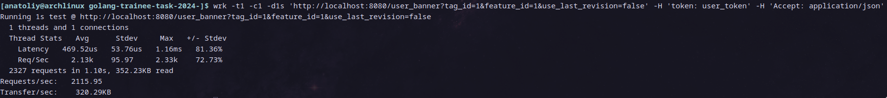
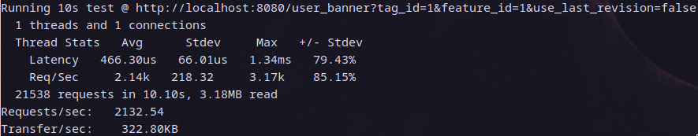
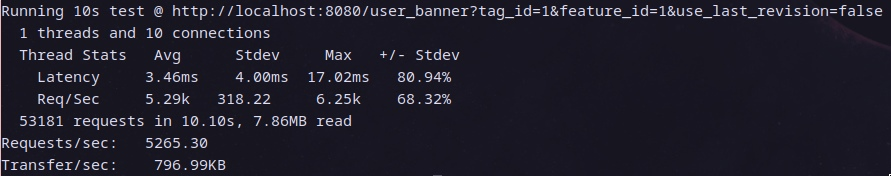

# golang-trainee-task-2024-

## Чеклист выполненных пунктов задания

 - Основное задание выполнено
 - Описать конфигурацию линтера: стандартная конфигурация [линтера](https://github.com/golangci/golangci-lint)
 - Реализовать интеграционное или E2E-тестирование для остальных сценариев (для всех эндпоинтов реализованы автотесты)
 - Провести нагрузочное тестирование полученного решения и приложить результаты тестирования к решению

## Стек

 - Язык программирования: Go(golang)
 - База данных: PostgreSQL
 - Деплой зависимостей и самого сервиса: Docker или Docker Compose

## Деплой зависимостей и самого сервиса

 > Примечание: запуск сервиса протестирован только на linux. 
 Инструкции по запуску написаны для линукса.
 Например, можно использовать виртуальную машину ubuntu LTS.
 Однако, сервис можно развернуть или собрать и на другой операционной системе,
 если установить эмулятор bash и требуемые в инструкциях зависимости.

 > Сервис сам создаёт все необходимые таблицы в базе данных.

 > Желательно установить утилиту make. Если её нет, то
 можете просто копировать команды из Makefile, но проще будет поставить.

Клонируйте этот репозиторий и перейдите в папку репозитория:

```bash
git clone https://github.com/CyberTea0X/golang-trainee-task-2024-.git
cd golang-trainee-task-2024-
```

Далее предполагается что вы изначально в папке репозитория.

### Через docker

Убедитесь что у вас установлен и настроен docker для вашей операционной системы.

Также у вас должен быть доступ к базе данных postgres (возможность создавать таблицы и
т.п. в указанной базе данных).
Либо вы можете запустить свою postgres базу данных командой `make start-db`.

Соберите docker image:

```bash
make docker-build
```

Укажите все необходимые переменные среды в файле .env (смотрите файл [env_example](./env_example).

Теперь вы можете запустить docker контейнер. Например, так:

 > При использовании этой команды сервис будет доступен на локальном порту 8080
 > Это можно изменить при помощи переменной среды `PORT`, переданной в докер контейнер.
 > Либо эту переменную можно просто добавить в .env файл.

```bash
make docker-run
```

### Через docker compose

Убедитесь что у вас установлены и настроены docker, docker_compose.

Укажите все необходимые переменные среды в файле .env (смотрите файл [env_example](./env_example).
Также можно указывать их вручную без файла, но это довольно-таки утомительный процесс.

Далее просто пропишите:

```bash
docker compose up
```

Эта команда запустит контейнер базы данных и контейнер сервиса. Сервис автоматически
настроит базу данных и подключится к ней.

По умолчанию сервис займёт порт 8080.
Чтобы это изменить, необходимо указать переменную окружения PORT перед запуском docker compose.
База данных займёт порт 5432, это можно легко изменить в compose.yaml (не забудьте также поменять порт в .env).

Пример:

```bash
PORT=25565 docker compose up
```

### Сборка из исходников и запуск

Вам понадобится [установленный golang](https://go.dev/doc/install).
Потом можно будет его удалить и пользоваться двоичным файлом сервиса.

Сперва убедитесь что у вас запущена база данных postgres в докере, локально,
или на удалённом сервере и у вас есть к ней доступ (вы можете зайти в неё с паролем,
создать таблицу и т.п.).

Укажите все необходимые переменные среды в файле .env (смотрите файл [env_example](./env_example).

Способ 1: 

```bash
go run .
```

Способ 2:

```bash
go build -o gobanners
```

Запустите сервис:

```bash
./gobanners
```

Двоичный файл вместе с .env можно поместить туда, куда вам нужно, остальное
можно удалить.

## Как работать с сервисом и документация API

Для начала разверните сервис где-нибудь и запишите ip и port, убедитесь, что
у вас есть доступ к этому адресу и порту.

Файл [openapi.html](./docs/openapi.html) можно открыть в браузере. В этом
файле описаны API и примеры запросов.

Файл [openapi.yaml](./docs/openapi.yaml) содержит документацию api в формате
openapi. Если вы не знаете, что это такое, лучше откройте его html версию.

Также можете импортировать файл [openapi.yaml](./docs/openapi.yaml) как API в Postman, после чего
создать на его основе коллекцию. После указания переменной адреса сервиса в коллекции,
вы можете выполнять запросы к сервису. Для большинства переменных postman установит заглушки
вида `\<integer\>`, поэтому их придётся заменить другими данными.

### Curl

Также вы можете обращаться к сервису через curl. 

Например, так вы можете создать баннер:
Данный запрос сработает, если сервис запущен локально на порту 8080, иначе,
вам придётся его модифицировать:

```bash
curl --location 'localhost:8080/banner' \
--header 'token: admin_token' \
--header 'Content-Type: application/json' \
--header 'Accept: application/json' \
--data '{
  "tag_ids": [1,2],
  "feature_id": 1,
  "content": "{\"title\": \"тестерс гонна тест\"}",
  "is_active": true
}'
```

Пример ответа для запроса выше: 

```json
{
    "banner_id": 1
}
```

Так вы можете получить содержимое баннера:

```bash
curl --location 'localhost:8080/user_banner?tag_id=1&feature_id=1&use_last_revision=false' \
--header 'token: user_token' \
--header 'Accept: application/json'
```

Пример ответа для запроса выше:

```json
{
    "title": "тестерс гонна тест"
}
```

Так вы можете обновить баннер:

```bash
curl --location --request PATCH 'localhost:8080/banner/1' \
--header 'token: admin_token' \
--header 'Content-Type: application/json' \
--header 'Accept: application/json' \
--data '{
  "tag_ids": [
    1
  ]
}'
```

Пример ответа: HTTP 200

Так вы можете получить баннеры с фильтрацией по фиче и/или тегу:

```bash
curl --location 'localhost:8080/banner?feature_id=1&tag_id=1&limit=1&offset=0' \
--header 'token: admin_token' \
--header 'Accept: application/json'
```

Пример ответа:

```json
[
    {
        "Id": 2,
        "tag_ids": [
            1,
            2
        ],
        "feature_id": 1,
        "content": "{}",
        "is_active": true,
        "created_at": "2024-04-14T16:07:31.515188Z",
        "updated_at": "2024-04-14T16:07:31.515188Z"
    },
    {
        "Id": 3,
        "tag_ids": [
            3
        ],
        "feature_id": 1,
        "content": "{\"title\": \"тестерс гонна тест\"}",
        "is_active": true,
        "created_at": "2024-04-14T16:19:30.595649Z",
        "updated_at": "2024-04-14T16:19:30.595649Z"
    }
]
```

Так вы можете удалить баннер:

```bash
curl --location --request DELETE 'localhost:8080/banner/1' \
--header 'token: admin_token' \
--header 'Accept: application/json'
```

Пример ответа: HTTP код 204

## Бенчмарки

 > Примечание: бенчмарки выполнены на уже нагруженной системе (браузер и тп),
 > поэтому результаты скорее всего чуть хуже чем могли бы быть.

Системная информация:

 - OS: Arch Linux x86_64.
 - Kernel: 6.8.5-arch1-1.
 - CPU: AMD Ryzen 7 2700X (16) @ 3.700GHz.
 - GPU: NVIDIA GeForce GTX 1660 SUPER.
 - MaxMemory: 32041MiB.

### Бенчмарк длительностью одну секунду:



### Бенчмарк длительностью 10 секунд:



### Бенчмарк длительностью 10 секунд, 5000 запросов в сек:



### Пример команды для бенчмарка:

```bash
wrk -t1 \
    -c1 \
    -d10s \
    'http://localhost:8080/user_banner?tag_id=1&feature_id=1&use_last_revision=false' \
    -H 'token: user_token' \
    -H 'Accept: application/json'
```

## Возникшие вопросы при выполнении задания

В `api.yaml` для GET /banner не был указан вариант ошибки 400, добавил это
